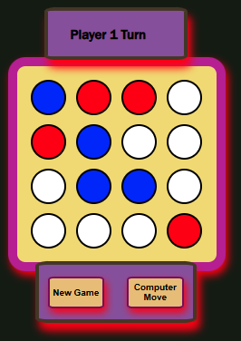

# Project goal

> ***JavaScript*** Development:
  * InnerHTML, Functions, Arrays, Events on HTML DOM

  * Developed small scripts for BG Color Changer, Photo Gallery

> _jQuery_ Development:
  * Implemented jQuery syntax and Selector, external jQuery File, Events, multiple Event Handlers, Animate, Callback Functions, Chaining,...  

  * Wrote a code for animation, X and Y coordinates
  
> React Simple Calculator Application:
  * Worked with React useState Hook that holds JSON object to track individual values.
  
  * Build Functional Components, learnt how to render these components and how React communicates between parent and child components using React properties and callback functions.
  
  * Implemented Calculator Display and Operators.
  
  * Did a build and deployed to Netlify.
  
  
> React Connect-4 Clone Board Game:
  * Developed a functional and playable Small GameBoard with 16 Circles
  
      * Used useEffect and useState Hooks while developing React app
    
      * Implemented Callbacks in response to Click Events 
      
          * Pass properties to Components and Deconstruct these properties in child Components
      
          * Style the components Header, Footer, and Board, with Different Styles including:
              -  Dynamic, Inline and Dynamic classes
      
          * Determine Winner and Draw condition. Update the Board Header with game State
    
      * Footer in initializing the board. Implemented Computer player(Basic AI)
    
      * Created some CSS Variables.
  
      * Did a build and deployed to Netlify.

## Contents  
<!-- #### Libraries -->

>  Used ES6(JavaScript) Template Strings, Ternery Expression, const keyword, map() method, Arrays, switch statement, Spread Operator, Comparison Operators

```js
 - Included jQuery library from Google CDN

 ```
 
### Libraries and versions

```
| Library    | Version       | 
|------------|---------------|
| JavaScript |ECMAScript/ES14|                
| jQuery     | 3.7.1         | 
| jQueryUI   | 1.14.1        |
| React      | 19.1.0        |
| Node.js    | 22.15.0       | 
```

## Tasks

- [x] JavaScript
- [x] jQuery
- [] react

## References
<details>

  [StackOverflowQ/A](https://stackoverflow.com  "QA")<br>
  [Medium](https://medium.com)<br>
  [Tutorialspoint](https://www.tutorialspoint.com)<br>
  [W3Schools](https://www.w3schools.com)
  
</details>

### Screenshots:

### Calculator


[OnNetlify](https://teal-bienenstitch-6e2de9.netlify.app/)


### Connect-4 Clone


[onNetlify](https://iridescent-quokka-786002.netlify.app/)


